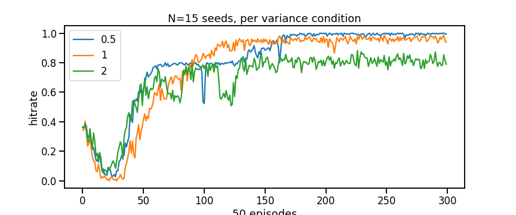

# Effect of stimulus separation on training
Target: find pretraining conditions that improve learning 
Question: Does curriculum stimulus help learning?
Question: How does variance in stimulus distribution affect training?

## General experiment setup:
- Reinforce agent
- fixed delay 3 steps (arbitrary)
- two gaussian stimuli
  - different means same variance
- reward +1 hold, +1 correct action, 0 otherwise

## Experiment: Effect of variance
How does variance in stimulus distirbution affect training?
- manipulation: Varying stimulus variance, measure action reward
- goal: show effect, then characterize relationship

**Result: variance imposes ceiling on hitrate**
- mu=[-1,1]
- dip early training probably because learning hold bias

**Result (aux2): possible non-monotonic relationship**
- unclear why lower variance would ever impair training. maybe something to do with range/null space of initial input weight matrix.
- note lower stim distribution variance makes learning curve more flat.

## Experiment: Stimulus means
- Experimented with different combination of stimulus means [0,1],[-1,1],[-10,10]. no interesting systematic differences found.

## Experiment: Variance-Curriculum
Does pretraining lower variance improve training time?
- conditions:
  - no-curr: trained on fixed max variance
  - curr: pretrained 80% trials low variance, final 20% of trials on max variance

**Result (main): TBD**

## Discussion
- In retrospect, variance experiment poorly motivated since stimuli are not noisy
- Internal representations as signal to advance curriculum

### Note to self
Since this repo was copied from curr-delay, the goal is to maintain backward compatibility

### Implementation efficiency
- using multiprocessing library to parallelize multi-seed experiments  