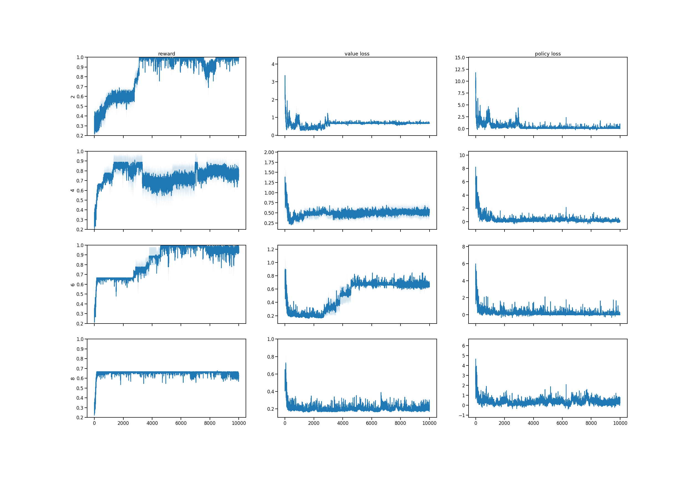
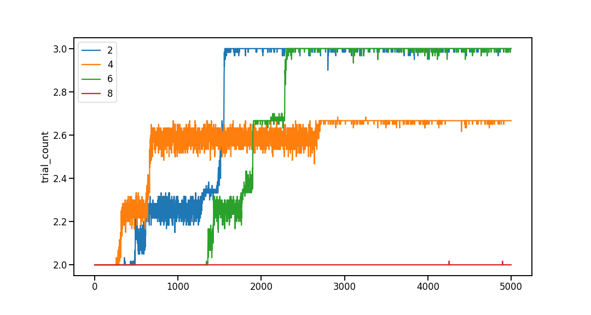
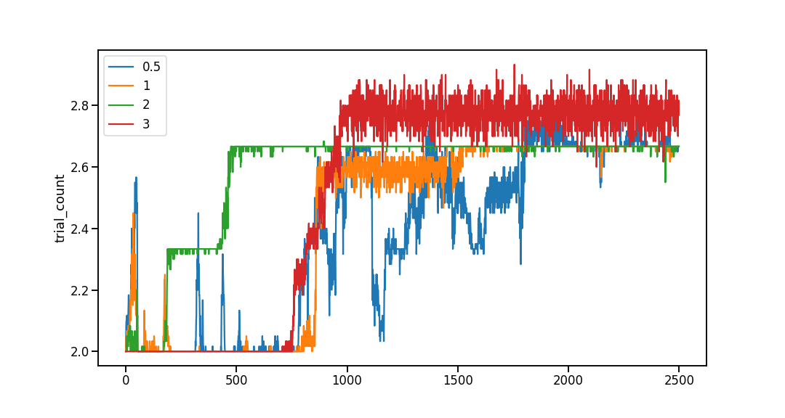

# The frustrated rodent simulation

## phenomenon 
* rodents get full water alotment at the end of the day
* if they violate a trial, punishment is timeout, they can't start new trial. 
* if they find the task gets too difficult, they stop doing trials / violate 100% 
* _would rather wait until end of day to get their water instead of doing this ridiculous task_. 

## simulation description
Goal: explore conditions for frustrated rodent phenomenon 
* every epoch corresponds to a day, i.e. sequence of trials. 
* at the end of the epoch, the agent gets alotted unclaimed reward (pub), so that total reward is always same per epoch, but reward distribution over time differs.
* simulate timeout violation punishment by setting epoch length fixed, and allowing agent to do more trials if fewer violations.
* manipulate discount factor to simulate preference for rewards now vs just waiting until end of day.

# Experiments

## goals

* show delay curriculum mitigates frustrated rodent phenomenon
  * reward too sparse if training on full trlen from start
* effects of discount factor (and TD methods)? 

## questions
* discount factor or TD methods with shorter horizon?
* actor critic only or Qlearning as well?

## exp todo
* result: delay curriculum helps
  * verify trains with short TR len
  * verify no train with long TR len
  * delay curriculum experiment
* explore: discount factors
  * 
* explore: TD updates
  * 

## Result 06/18 (secondary) loss weight fitting
* previous simulations, I realized loss weight had to be quite high compared to other applications to get training off the ground. here I ran a few simualtions looking for ceiling performance in simplest case with violation timeout trials (3 trials, trlen 3).

* found ceiling performance with 3 trials of trlen 3
  * training for 100k
  * gamma=1.0, learn_rate=0.005
  * tried different loss_weights
  * with violation timeout, no pub
  * 3 seeds per condition

* to verify how learning differed across loss weights, did a small search over different weight values

* to help understand number of trials violated, I plotted mean (across seeds) number of valid trials

* followup replication experiment using half number of training trials confirmed good training (although not ceiling) obtained with lossweight within `0.5-3`

* notebook: `exp-loss_weights-pwm5-3trials_timeout`

# implementation 

## notes
* task and agent objects. `runepoch` function loops `task.sample_trail()`.
* agent response influences trial type (valid vs not-valid). not valid corresponds to intertrial interval, implemented as a zero-delay of length `trlen`.
* support different `trlen` for each epoch to allow delay-curriculum. epoch_len must be fixed. padding might be required when epoch len not divisible by trial len. although using epoch=len 60, trlen=2,3,4 require no padding.
* pub happens on final step (epoch_len+1)

## simplifications
* 5 stimuli (ABCDE), onehot embeddings
* epoch length fixed at 60, ITI = trlen = 5 (delay 3)

## note on sparse reward
* currently failing to hold (during trial and ITI) makes the following trial not-valid. since not-valid trials have no reward opportunity, the envrionment reward is very sparse. might make learning difficult if agent gets stuck in violating every trial. might need to pretrain holding behavior to get learning off the ground. 

## note: impactful bug 06/19
* RNN state was not being carried over trial boundaries. replaced `self.rnn(obsA)`  with `self.rnn(obsA,(self.h_t,self.c_t))`. secondary results from 05/18 invalidaded. also invalidates results from `loss-weight-study-0614`.

## note: critical bug 06/12
* when unrolling the environment, I was previously collecting data by using `list.extend()`. when extending a list with pytorch tensors, the tensor object lost track of gradient information. 

