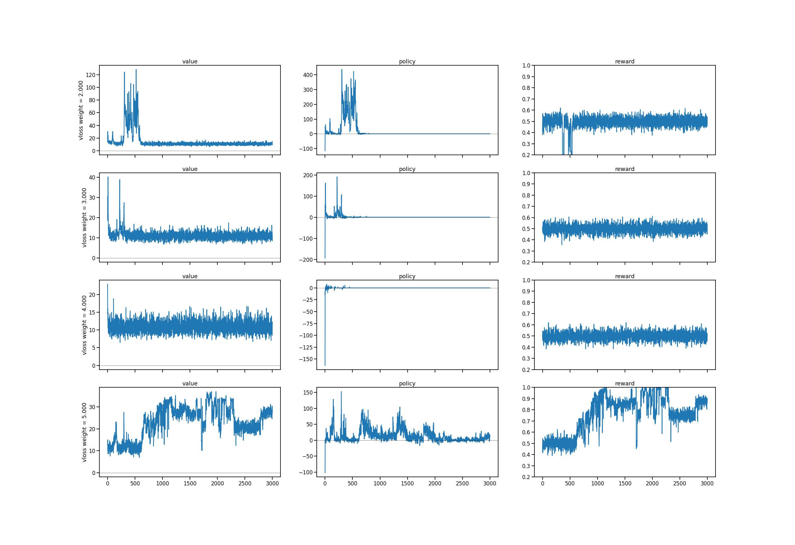
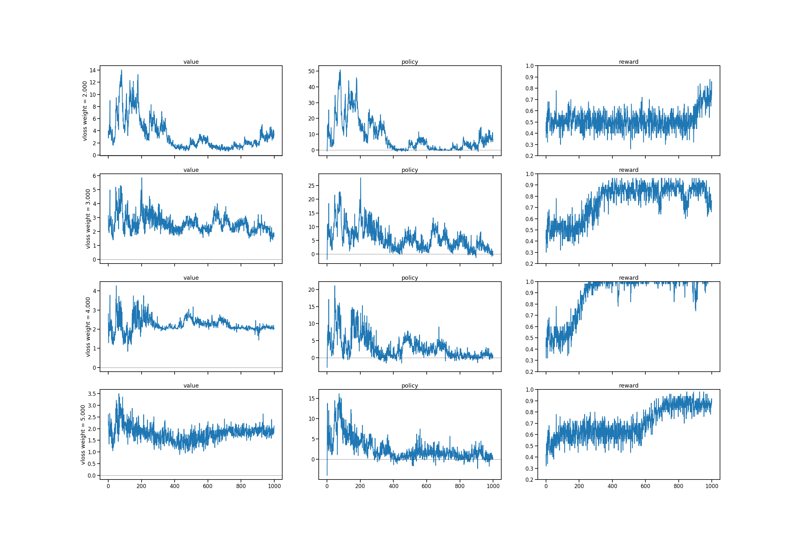
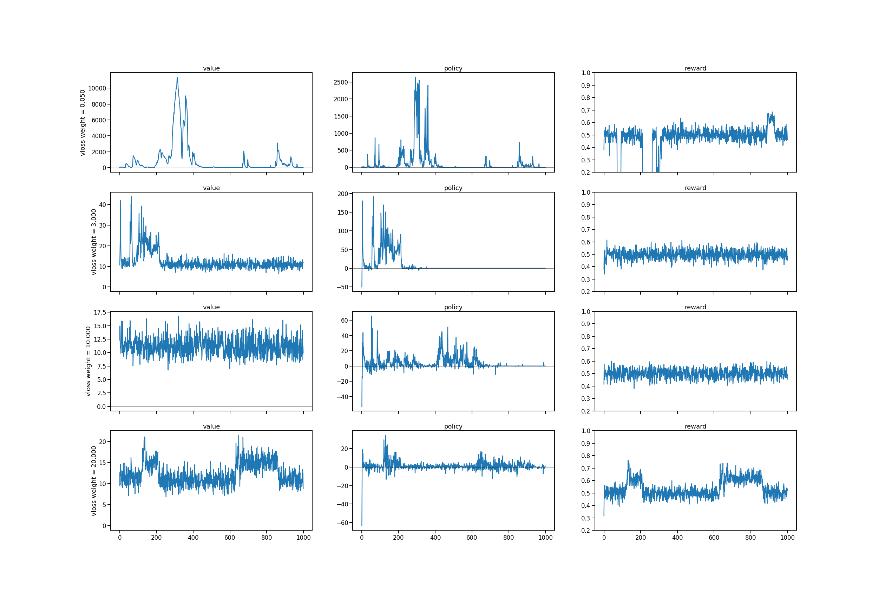

# loss weight study
* how does policy loss and value loss balance each other out?
* no principled way to choose critic vs actor loss weights. 

## main results: fit-pwm5
* single seed experiments, gridsearching critic loss weight and hand tuned learning rate. 

* in single seed experiments, when `epochlen = 60`, training for `30k epochs`, only found learning for `learning rate = 0.005` & `critic weight = 5` 

* when `epochlen = 15`, in multiseed setup training for `10k epochs`, found learning for `critic weight = 2,3,4,5` 

## discussion
* important observation: one reocurring failure mode of a loss weight that is too low is the value loss explodes.
* important challenge for future simulations: changing the trial length changes the optimal value loss weight setting

## aux results: poor training for different learning rates

## fit-pwm notebooks discussion re: critic loss weight magnitude
* unlike other applications, where I used a critic loss weight less than one, here better performance is attained with having the critic (value) loss weight greater (sometimes an order of magnitude) than the policy loss.

## note: task implementations
* pwm0: trivial version of the task, where response is entirely given by second stimulus
* pwm5: 5 stimuli (ABCDE), 8 possible combinations (AB,BA,...,DE,ED). 2 combinations are trivial (i.e. response given by second stim).
* extra
  * no timeout
  * action only rewarded (no reward for hold)

## note: critical bug 05/12
* when unrolling the environment, I was previously collecting data by using `list.extend()`. when extending a list with pytorch tensors, the tensor object lost track of gradient information. 
