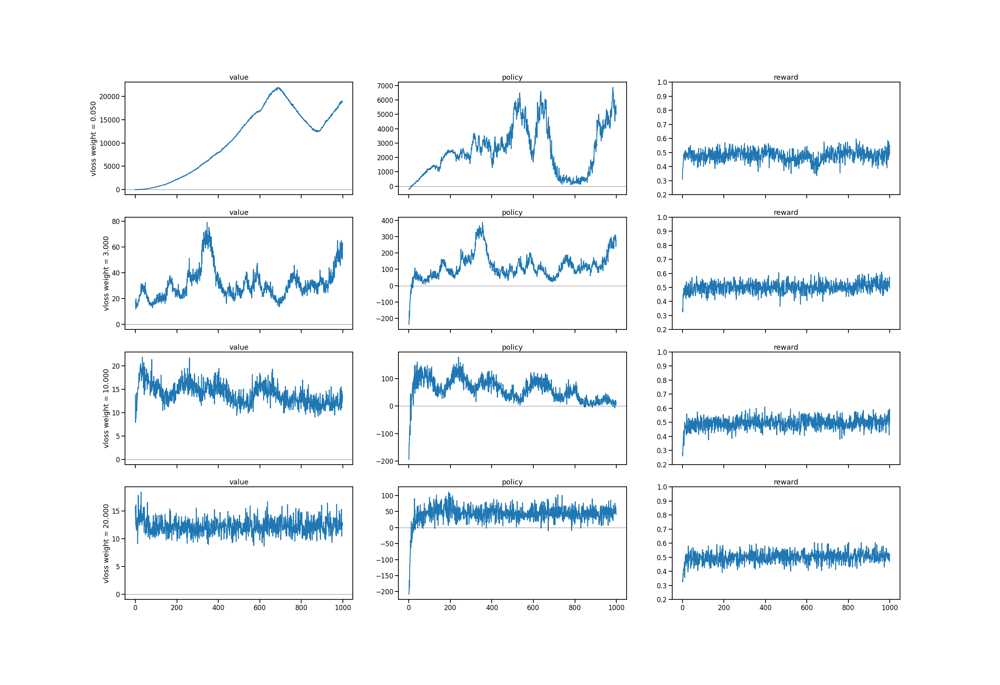

# loss weight study
* how does policy loss and value loss balance each other out?
* havent found a principled way to choose critic vs actor loss weights. 

## main result: fit-pwm5
* ran single seed experiments, gridsearching critic loss weight and learning rate. 
* fastest training attained with `learning rate = 0.005` & `critic weight = 2` 

## fit-pwm notebooks discussion re: critic loss weight magnitude
* unlike other applications, where I used a critic loss weight less than one, here better performance is attained with having the critic (value) loss weight greater (sometimes an order of magnitude) than the policy loss.

## note: task implementations
* pwm0: trivial version of the task, where response is entirely given by second stimulus
* pwm5: 5 stimuli (ABCDE), 8 possible combinations (AB,BA,...,DE,ED). 2 combinations are trivial (i.e. response given by second stim).
* extra
  * no timeout
  * action only rewarded (no reward for hold)

## note: critical bug 05/12
* when unrolling the environment, I was previously collecting data by using `list.extend()`. when extending a list with pytorch tensors, the tensor object lost track of gradient information. 
