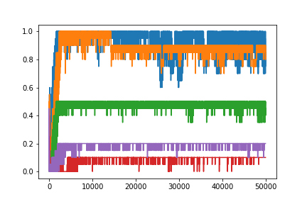

# Effect of delay length on training

## experiment: delay length on training time
How does delay time between first and second stimulus affect training?

Experiment setup:
- two one-hot stimuli
- reward +1 hold, +1 correct action, 0 otherwise
- vary number of timesteps between first and second stimuli

*Result: Shorter delays train faster on selecting rewarded action*
- Not surprising, shorter term credit assignments are easier.

Result: Longer delays train faster on holding
- Consequence of training protocol: One backprop per trial; since longer delays have more holding timesteps, each trial has more rewarded hold timesteps.
  - future experiments should try to control for this

## experiment: does pretraining shorter delays improve training time?

