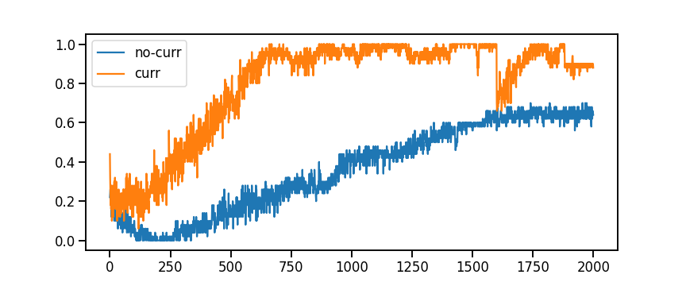

# Effect of delay length on training

Experiment setup:
- REINFORCE agent
- two one-hot stimuli
- reward +1 hold, +1 correct action, 0 otherwise

## Experiment: Delay
How does delay time between first and second stimulus affect training?
- manipulation: Varying delay length, measure action reward

**Result (main): Shorter delays train faster on selecting rewarded action**
- Not surprising, shorter term credit assignments are easier.

**Result (aux): Longer delays train faster on holding**
- Consequence of training protocol: One backprop per trial; since longer delays have more holding timesteps, each trial has more rewarded hold timesteps.
  - future experiments should try to control for this

## Experiment: Delay-Curriculum
Does pretraining shorter delays improve training time?
- conditions:
  - no-curr: trained on delay 5
  - curr: pretrained 80% of trials on delay 1, final 20% of trials on delay 5

**Result (main): learning curr > no-curr**

## Discussion
Here curriculum was hand specified. Future experiments could investigate whether automated criterion (e.g. based on target accuracy) could be used to advance agent through curriculum stages.
